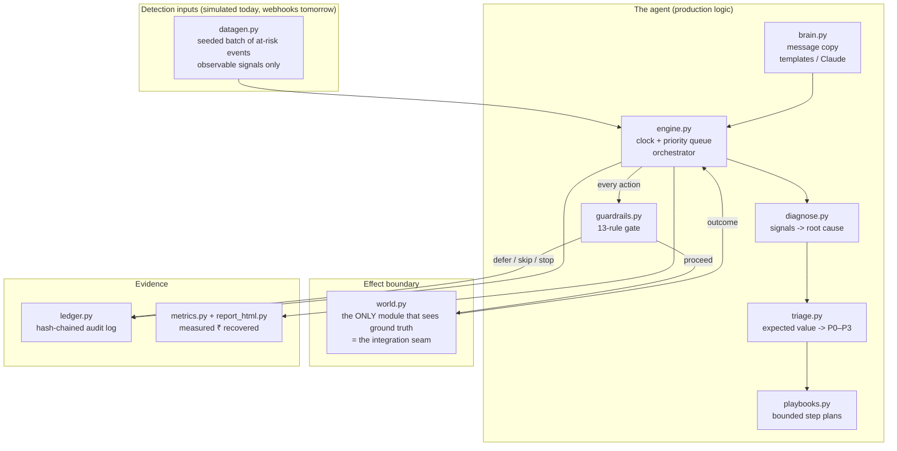

# Architecture

Sanjeevani is an event-driven recovery agent built around one principle:
**every rupee-moving decision must be deterministic, bounded, and on the
record.** This document explains how the pieces fit and why the seams are
where they are.

## 1. System overview



## 2. The case lifecycle

A case is a state machine with no cycles that can run away:

```
DETECTED ──diagnose──> IN_RECOVERY ──> RECOVERED        (money captured)
   │                        │──────────> ESCALATED       (human handoff / dispute)
   │                        │──────────> STOPPED         (a stopping rule fired)
   └── unrecoverable ──────>└──────────> WRITTEN_OFF     (playbook/horizon exhausted)
```

Terminal states are terminal the engine drops any queued action for a
terminal case on the floor (and the horizon sweep catches the rest).

## 3. The engine: a clock, a heap, and nothing clever

`engine.py` runs a simulated clock over a priority queue of
`(when, case, step_index)` items:

1. **Intake**:- for every detected case: diagnose -> triage -> assign playbook
   (or write off unrecoverables with zero contact). Schedule step 0.
2. **Drain**:- pop the earliest action. If the case is terminal or the action
   is past the 14-day horizon, drop it. Otherwise ask guardrails.
3. **Verdict**:- `proceed` executes against the world; `defer` reschedules the
   same step (max 3 times, then it becomes a skip); `skip` advances to the
   next step; `stop` terminates the case. All four paths write ledger entries.
4. **Outcome**:- `PAID`/`PROMISE_KEPT` recover money (net of any discount);
   `PROMISE_MADE` schedules the promise check on its due date;
   `DISPUTE_RAISED` freezes the case and escalates; `NOTICE_DELIVERED` stamps
   the RBI pre-debit timestamp that later retries are validated against;
   `NO_RESPONSE` advances the playbook. Exhausted playbook ⇒ write-off.

Delays in playbooks are declarative and resolved against the sim clock:

| Delay | Meaning |
|---|---|
| `+26h` | 26 hours after the previous step resolved |
| `salary_day` | next occurrence of the customer's salary day, at 10:00 |
| `promise_due` | the due date the customer committed to on the call |

## 4. Guardrails: verdicts, not vetoes

`guardrails.check()` returns a `Verdict` `proceed | defer | skip | stop`
plus the rule that fired and a human-readable reason. The distinction matters:

- **defer** = right action, wrong time (quiet hours, weekly cap, notice still
  cooling). The intent is preserved.
- **skip** = this step is not allowed for this case (no consent, negative EV,
  small ticket, stale notice, paused channel). The playbook continues.
- **stop** = stop working the case entirely (attempt cap, contact cap,
  dispute freeze).

Rules are checked in a fixed order (compliance before economics), and each
non-proceed verdict is a ledger event. The rule catalog and every threshold
live in `config.Policy`, which is snapshotted into ledger entry #0.

### The expected-value stopping rule

Before spending on an action, the agent computes
`p̂ = prior(cause, action) × diagnostic confidence × fatigue^contacts` and
blocks the action if `cost > p̂ × amount`. The prior table is shared with the
simulation world the same calibration loop a production system would run
against its own historical conversion data.

## 5. The ledger: refusals are first-class

Append-only JSONL. Each entry:

```json
{"seq": 412, "at": "2026-08-08T18:05:00", "event": "ACTION_EXECUTED",
 "case_id": "case_00196", "actor": "sanjeevani",
 "payload": {"channel": "voice_hinglish", "outcome": "promise_made", "...": "..."},
 "prev_hash": "77d89b…", "hash": "aa01f3…"}
```

`hash = SHA-256(canonical entry minus its own hash)`; `prev_hash` links the
chain. `python3 -m engine verify` re-walks it: edit, delete or reorder any
line and verification names the broken sequence number. Event vocabulary:

`RUN_STARTED` (policy snapshot) · `CASE_DETECTED` · `DIAGNOSED` · `TRIAGED` ·
`PLAYBOOK_ASSIGNED` · `ACTION_EXECUTED` · `ACTION_DEFERRED` · `ACTION_SKIPPED`
· `GUARDRAIL_STOP` · `PROMISE_RECORDED` · `PROMISE_RESOLVED` ·
`DISPUTE_RAISED` · `CHANNEL_PAUSED` · `CASE_RECOVERED` · `CASE_ESCALATED` ·
`CASE_STOPPED` · `CASE_WRITTEN_OFF` · `RUN_COMPLETED` (metrics digest).

## 6. The world: one seam to production

`world.perform(case, step, now) -> (Outcome, detail)` is the entire surface
between the agent and reality. In the demo it's a seeded simulator whose
outcomes are drawn per `(seed, case, attempt#)` which makes whole runs
reproducible down to the ledger head hash. In production it becomes:

| Simulated today | Real tomorrow |
|---|---|
| retry outcomes | Payments API re-attempt + webhook |
| mandate re-presentation | e-mandate presentation APIs (post-notice) |
| email/SMS/WhatsApp sends | channel providers (SES, Gupshup, …) |
| Hinglish voice call | voice-bot provider + transcript |
| promise-to-pay resolution | invoice settlement webhook |

Nothing upstream imports anything from `world.py` except the engine's single
call site.

## 7. What the LLM is (and isn't) allowed to do

`brain.py` drafts outbound copy. If `ANTHROPIC_API_KEY` is set and the
`anthropic` package is installed, drafts are polished by `claude-opus-4-8`
(adaptive thinking, cached per template, hard fallback to templates on any
error). The LLM has **no authority**: it cannot pick actions, change timing,
or touch amounts. Decisions stay deterministic and testable; language gets to
be humane and Hinglish.

## 8. Testing philosophy

- `tests/test_ledger.py`:- tamper-evidence: edit/delete/reorder detection.
- `tests/test_guardrails.py`:-  one direct test per rule, including the RBI
  notice window state machine and the EV stop.
- `tests/test_engine.py`:-  batch-level *invariants*: no contact in quiet
  hours ever, risk-declines never contacted, every mandate retry preceded by
  a valid notice, disputed invoices never dunned, all workflows bounded, and
  bit-for-bit determinism of the ledger across runs of the same seed.

The compliance rules aren't just implemented they're asserted over every
case of every test batch.
