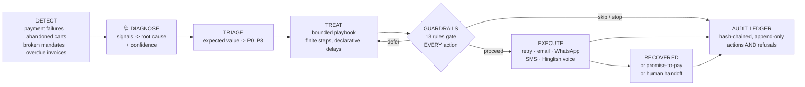

# SANJEEVANI: A Revenue Resuscitation Engine

> In the Ramayana, when Lakshmana lay dying, Hanuman didn't debate he brought
> the **Sanjeevani** herb and revived him. Every day, your revenue lies on the
> same battlefield: a payment degrades, a checkout gets abandoned, a mandate
> pauses, an invoice quietly ages past 45 days. **Sanjeevani is the agent that
> flies in, diagnoses what's actually dying, and brings the money back with
> the discipline of a doctor, not the desperation of a debt collector.**

```python
   _____ ___    _   __     ____________ _    _____    _   ______
  / ___//   |  / | / /    / / ____/ __// |  / /   |  / | / /  _/
  \__ \/ /| | /  |/ /__  / / __/ / _/  | | / / /| | /  |/ // /
 ___/ / ___ |/ /|  / /_/ / /___/ /___  | |/ / ___ |/ /|  // /
/____/_/  |_/_/ |_/\____/_____/_____/  |___/_/  |_/_/ |_/___/
```

Built for the **AI Revenue Recovery** track: an agent that *detects revenue at
risk, determines the right intervention, and executes a bounded recovery
workflow* and then proves it, with **measured money recovered across a
batch, compliant escalation, stopping rules, and a tamper-evident audit
trail**.

```
  at risk            ₹1,75,33,179   across 200 cases
  recovered       ₹1,00,36,502.35   (57.2% of value, 85 cases)
  spend                 ₹2,096.10   (ROI 4788×)
  audit ledger    ✔ intact: 1560 entries, hash chain verified
```

*(actual output of `python3 -m engine demo`, seed 42 reproducible to the
byte on your machine)*

---

## The 90-second tour

```bash
git clone <this repo> && cd <this repo>
python3 -m engine demo            # zero dependencies. pure stdlib. ~2 seconds.
```

You get:

| Artifact | What it is |
|---|---|
| console report | measured ₹ recovered, per-leak breakdown, every guardrail that fired |
| `out/dashboard.html` | self-contained dashboard (open it light & dark mode) |
| `out/ledger.jsonl` | **hash-chained audit ledger** of every decision, action *and refusal* |
| `out/report.json` | machine-readable metrics |

Then interrogate it:

```bash
python3 -m engine verify --ledger out/ledger.jsonl   # walk the hash chain
python3 -m engine case case_00196                    # one case's full life story
python3 -m engine baseline                           # duel vs the dumb dunning cron
python3 -m engine serve --time-scale 60              # real-time daemon (test-mode keys)
python3 -m unittest discover -s tests                # 53 tests, incl. compliance invariants
```

Try editing a single character in `out/ledger.jsonl` and re-running `verify`
it tells you exactly which entry was cooked.

---

## Why this is not "a dunning cron job"

Revenue loss rarely happens in one clean step, and neither does recovery.
Sanjeevani treats every leak like an ER admission:



The catch most systems miss: **the refusals are the product.** An agent that
moves money must be able to prove not just what it did, but what it declined
to do, and why. Sanjeevani's ledger records both with equal ceremony.

### Proof, not posture: I ran the dunning cron too

Claiming to beat "a dumb retry cron" is cheap, so the repo ships the cron —
`python3 -m engine baseline` runs the **same seeded world** through a typical
nightly dunning job (retry everything, email + SMS everyone at 21:30, no
diagnosis, no guardrails) and through Sanjeevani, then scores **both** action
streams with the same ground-truth policy auditor:

|                     | dumb cron | Sanjeevani |
|---------------------|-----------|------------|
| recovered (seed 42) | ₹70,24,140 (40.1%) | **₹1,00,36,502.35 (57.2%)** |
| spend               | ₹2,789 | **₹2,096** |
| customer contacts   | 2,525 | **314** |
| disputes provoked   | 12 | **3** |
| promises kept       | 0/0 | **9/9** |
| policy violations   | **7,195** (quiet hours 2,525 · weekly cap 2,097 · contact cap 1,986 · consent 329 · dispute freeze 214 · missing pre-debit notice 44) | **0** |
| audit trail         | none (it's a cron) | hash-chained ✔ |

Everything else world, seed, priors, attempt-fatigue is held constant, so
the delta is exactly what diagnosis + guardrails + stopping rules add: **₹30
lakh more recovered, with an eighth of the contact burden and zero
violations.** And the engine's zero is *measured* by the same auditor that
scored the cron, not asserted.

### Diagnosis picks the cure, not a template

| Root cause (from signals) | Playbook | The idea |
|---|---|---|
| `GW_91` issuer downtime | **lazarus_retry** | the bank was down, the money wasn't silent retries, then a link |
| `BANK_51` insufficient funds | **payday_patrol** | retry when the *salary lands* (per-customer salary day), not when the cron fires |
| `BANK_54` expired card | **card_transplant** | no retry fixes expired plastic capture a new instrument |
| 3DS OTP timeout | **second_tap** | intent was real, friction won one-tap resume link while it's warm |
| cart dropped at order review | **winback** | nudge -> reassure -> *bounded* sweetener (offer clamped by policy, cost accounted) |
| e-mandate paused | **mandate_cpr** | RBI-clean: pre-debit notice -> wait ≥24h -> re-present; notice goes stale at 72h |
| invoice stuck in approvals | **receivables_ladder** | polite -> statement -> Hinglish voice call -> **promise-to-pay tracked to its due date** -> human |
| invoice disputed | **dispute_firebreak** | a disputed invoice is a conversation, not a campaign freeze & escalate immediately |
| risk decline | *(none)* | never chase a risk-declined payer. Written off, zero contact, on the record |

### The 13 guardrails (every action passes through all of them)

**Compliance**:- quiet hours 21:00–08:00 (defer, don't drop) · voice calls
10:00–19:00 only · channel consent or it doesn't send · RBI pre-debit notice
≥24h and ≤72h before any mandate re-presentation · dispute ⇒ total freeze.

**Stopping rules**:- max 4 contacts per case · max 3 contacts per customer per
week (across cases) · max 8 attempts total · **negative-expected-value stop**
(never spend ₹12 chasing an expected ₹9) · small-ticket rule (sub-₹250 cases
get near-free channels only) · per-channel circuit breaker (a channel
performing at noise level gets paused for the whole batch) · discount offers
clamped to policy ceiling · 14-day hard horizon then the workflow *ends*.

Every rule lives in one dataclass ([`engine/config.py`](engine/config.py)),
and a snapshot of the entire policy is the first entry of every ledger an
auditor can always answer *"under which rules did the agent act?"*

---›

## How it maps to the bar

> *"Don't just identify the problem. Show measured money recovered across a
> batch, with compliant escalation, stopping rules, and an audit trail."*

| The bar | Where Sanjeevani clears it |
|---|---|
| **Measured money recovered across a batch** | Deterministic seeded batch -> `recovered ₹1.00Cr of ₹1.75Cr at risk (57.2%)`, per-leak and per-channel breakdowns, net of discounts and channel spend. Same seed ⇒ same rupees, byte-for-byte (there's a test for it). |
| **Compliant escalation** | Disputes freeze outreach instantly and hand to a human; receivables ladder ends in a human with a full dossier; risk declines are never contacted; every escalation is a ledger event. |
| **Stopping rules** | Attempt caps, contact caps, weekly frequency caps, EV-negative stop, small-ticket stop, stale-notice stop, circuit breaker, hard time horizon each individually unit-tested. |
| **Audit trail** | Append-only JSONL, SHA-256 hash-chained, `verify` CLI, tamper tests. Refusals (`ACTION_DEFERRED`, `ACTION_SKIPPED`, `GUARDRAIL_STOP`) are first-class events. |

---

## Honest architecture (what's simulated, what's real)

The **simulation world** (`world.py`) is the only module that sees ground
truth. It stands exactly where Razorpay webhooks + channel providers would
stand, behind the same one-method seam (`perform(action) -> outcome`). Swap it
for real integrations and *nothing upstream changes* the engine, guardrails,
playbooks and ledger are production logic, not demo props.

Crucially, the world and the guardrails share the same prior table
(`config.PRIORS`) the agent's expected-value math is calibrated against the
world it acts in, the same way a production system would calibrate priors
against its own historical conversion data.

### Real time, for real: `serve`

The batch demo is the *evaluation harness* it proves the brain's decisions
over 200 cases with measurable, reproducible money. The **product** is
`python3 -m engine serve`: the same engine (same diagnosis, playbooks,
guardrails, hash-chained ledger literally the same class) running as a
live daemon against test-mode Razorpay:

```bash
export RAZORPAY_KEY_ID=rzp_test_... RAZORPAY_KEY_SECRET=...   # free test keys
python3 -m engine serve --time-scale 60
```

Fail a test payment in your Razorpay dashboard and watch, live: the daemon
**detects** it within one poll, maps the gateway error into the diagnostic
vocabulary, **diagnoses** the root cause, assigns the playbook, and when
the step comes due checked against all 13 guardrails at execution time
creates a **real payment link**. Pay that link and the case resolves
**recovered**, every event appending to the same tamper-evident chain
(`out/live/ledger.jsonl`, one continuous chain across restarts; walk any
case with `python3 -m engine case <id> --out out/live`).

- **No public URL needed** detection and resolution poll the REST API, so
  it runs on a laptop; a signature-verified webhook receiver
  (`python3 -m engine razorpay webhook`) is supported as well.
- **`--time-scale 60`** runs the virtual clock 60× wall speed so a "+6h"
  playbook delay fires in 6 minutes guardrails check the virtual clock,
  so quiet hours and RBI notice windows are fast-forwarded, never bypassed.
- **Structurally safe**: the client refuses any key that isn't `rzp_test_*`
  (live money cannot move through this code), and money-moving outcomes
  come only from Razorpay-confirmed payment state (polled link status or
  HMAC-verified webhooks).

One-shot seam check without the daemon: `python3 -m engine razorpay smoke`.

```
engine/
├── datagen.py           seeded synthetic batch: observable signals ⊥ hidden truth
├── diagnose.py          signals -> root cause + confidence (deterministic rules)
├── triage.py            expected value -> P0–P3
├── playbooks.py         8 bounded playbooks, declarative delays ("+26h", "salary_day", "promise_due")
├── guardrails.py        13 rules; verdicts: proceed / defer / skip / stop
├── engine.py            event-driven orchestrator over a simulated clock (heapq)
├── world.py             the ONLY module with ground truth the integration seam
├── razorpay_world.py    the same seam against real test-mode Razorpay APIs
├── live.py              real-time daemon: live detection -> diagnosis -> recovery
├── baseline.py          the dumb dunning cron + ground-truth policy auditor
├── ledger.py            SHA-256 hash-chained append-only audit log + verifier
├── brain.py             message copy: templates, optionally polished by Claude
├── metrics.py           measured-money-recovered accounting
├── report_html.py       self-contained dashboard (light/dark, zero assets)
├── config.py            policy-as-code: every knob, snapshotted into the ledger
└── cli.py               demo · serve · baseline · razorpay · verify · case
```

Deeper dive: [ARCHITECTURE.md](ARCHITECTURE.md).

*Sanjeevani: because "gentle reminder for the payment" deserved better
engineering.*
